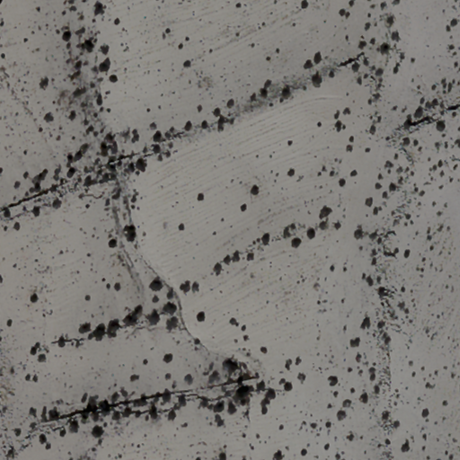
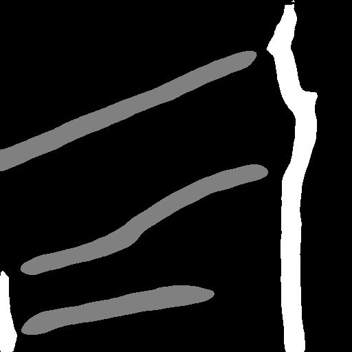
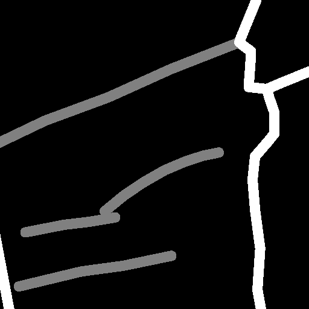

# international-archaeology-ai-challenge

Codes for the [HIDA/IDSI international archaeology AI challenge](https://www.helmholtz-hida.de/en/events/internationale-ki-challenge-archaeologie/). The task is multiclass semantic segmentation of ancient agricultural terrace/wall in the Negev desert. We use UNet/DeepLabV3+ with EfficientNet backbone and get an overal IOU (foreground only) of 0.31.

|     |     |     |
|:---:|:---:|:---:|
||||
| Orthophoto | Prediction | GroundTruth |

## data
- The training data are 500 512*512 image patches, each patch containing 9 feature images (Orthophoto, Aspect, DTM, Flow_Accum, Flow_Direction, Prof_curv, Slope, Tang_curv, Topo_Wetness).
- The testing data (for final score) are 200 unseen image patches.

## model
- architecture: [UNet](https://arxiv.org/abs/1505.04597)/[DeepLabV3+](https://arxiv.org/abs/1802.02611v3), we merge the output probability map of both models to calculate the final prediction
- backbone: [efficientnet-b5](https://arxiv.org/abs/1905.11946) (pretrained on ImageNet)

Codes for the models are based on [segmentation-models-pytorch](https://github.com/qubvel/segmentation_models.pytorch).

## loss and optimizer
Cross entropy loss + DICE loss, AdamW optimizer, cosine loss decay

## Usage

- train: `python main_train.py` or `bash train.sh`
- inference: `python main_inference.py` or `bash inference.sh` (`python main_inference_2model.py` to do inference with merged models)
- evaluate: `python main_test.py`
